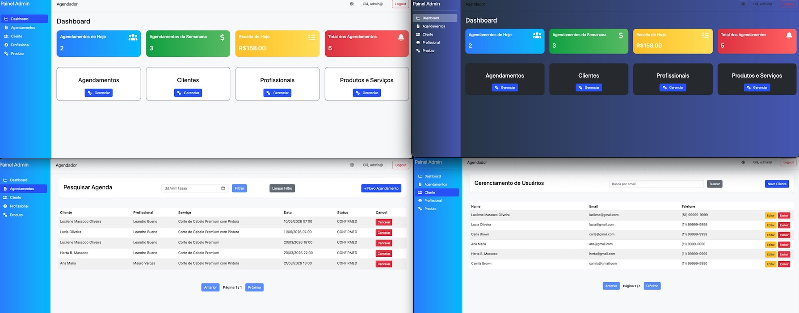

# Appointment Management platform

> Status: Developing

A full-stack appointment management system designed to handle scheduling, users, services, and business metrics.


 


## Objective
The main goal of this project is to build a scalable API and modern UI for managing appointments efficiently.

## Domain
The system is centered around appointments, with the following entities:
* Customer
* Professional
* Service (Product)
* Appointment 
* Metrics

## Preview


## Monorepo Structure
This project follows a monorepo architecture, keeping frontend and backend together:
````
  appointment-management/
  ├── backend/   (Spring Boot + JWT + Clean Architecture)
  ├── frontend/  (Angular)
  ├── docker-compose.yml
  └── README.md
````

# BACKEND (Spring Boot)
Architecture
* Controllers (DTO layer)
* Services (Business rules)
* Repositories (Data access)
* Models / Entities
* Security (JWT + Spring Security)
* Infrastructure layer
* Scheduled Jobs

## Background Jobs
* Automatically update appointment status
  * CONFIRMED → COMPLETED
* Remove old appointments (older than 6 months)

## Appointment Service Logic
1. Retrieve the service duration
2. Calculate endsAt
3. Validate scheduling conflicts:
````
  novoInicio < existenteFim
  novoFim > existenteInicio
````
 4. Save appointment

## Authentication (JWT)
Login Request
````
POST /auth/login
Content-Type: application/json
{
  "email": "admin@email.com",
  "password": "123456"
}
````

Response
````
{
  "id": "12345678-1234-1234-1234-123456781010",
  "email": "admin@",
  "accessToken": "eyJhbGciOiJIUzI1NiIsInR5cCI6IkpXVCJ9...",
  "expiresIn": 1774036219994
}
````

Using the Token
````
Authorization: Bearer YOUR_TOKEN
````

# FRONTEND (Template e UI)
* Auth com JWT (usando seu backend)
* HTTP Interceptor para token
* Auth Guard
* Role-based UI (ex: ADMIN vs PROFESSIONAL)
* Loading states
* Error handling centralizado
* Toast notifications
* Reactive Forms
* Form validation elegante
* UI moderna (Angular Material ou Tailwind)

## Frontend Tecnologies
* Angular — Framework principal da aplicação
* Bootstrap — Estilização e responsividade
* AdminLTE — Template administrativo baseado em Bootstrap
* jQuery — Manipulação de DOM (necessário para alguns plugins do AdminLTE)
* Font Awesome — Ícones utilizados na interface

## Frontend Structure
````
src/app/
 ├── core/        (auth, interceptors, guards)
 ├── shared/      (components reutilizáveis)
 ├── features/
 │    ├── appointments/
 │    ├── customers/
 │    ├── professionals/
 │    └── products/
 └── layout/
````

## Configuração no Angular
Para garantir o funcionamento correto dos estilos e scripts, os arquivos foram adicionados no angular.json:

+ Styles
````JSON
"styles": [
  "node_modules/@fortawesome/fontawesome-free/css/all.min.css",
  "node_modules/admin-lte/dist/css/adminlte.min.css",
  "node_modules/bootstrap/dist/css/bootstrap.min.css",
  "src/styles.css"
]
````

+ Scripts
````JSON
"scripts": [
  "node_modules/jquery/dist/jquery.min.js",
  "node_modules/bootstrap/dist/js/bootstrap.bundle.min.js",
  "node_modules/admin-lte/dist/js/adminlte.min.js"
]
````

## Dark Mode
O sistema possui suporte a modo escuro através da classe global:
````CSS
body.dark-mode {
  background-color: #1e1e2f;
  color: #f1f3f5;
}
````

Exemplo de customização de componentes:
````CSS
body.dark-mode .modal {
  background-color: #2b3035;
  color: #f1f3f5;
}

body.dark-mode .table {
  background-color: #2b3035;
  color: #f1f3f5;
}
````

### Observações Importantes
* O AdminLTE depende de jQuery para funcionamento completo
* Os plugins (como tabelas, modais, etc.) precisam dos scripts carregados corretamente
* Alguns componentes podem precisar de inicialização manual via jQuery

### Boas Práticas Aplicadas
* Separação de assets em src/assets
* Uso de Bootstrap para responsividade
* Padronização visual com AdminLTE
* Customização via CSS global (dark mode)

### Possíveis Melhorias Futuras
* Remover dependência de jQuery (usar Angular puro)
* Criar componentes reutilizáveis (cards, modais, tabelas)
* Implementar tema dinâmico (dark/light toggle persistente)
* Migrar para bibliotecas modernas como:
  * Angular Material
  * Tailwind CSS

# Running the Project
1. Backend
````
  cd backend
  ./mvnw spring-boot:run
````
 - Backend runs on:
````
  http://localhost:8080
````
2. Frontend
````
  cd frontend
  npm install
  ng serve
````

# Docker Setup – Full Stack (PostgreSQL + Spring Boot + Angular)

Este projeto utiliza Docker para orquestrar toda a aplicação, incluindo:

- PostgreSQL (Banco de dados)
- Spring Boot (Backend)
- Angular (Frontend)


# Estrutura do Projeto
```
appointment-management-api/
├── backend/
│   ├── Dockerfile
│   └── target/app.jar
├── frontend/
│   ├── Dockerfile
│   └── ...
├── docker-compose.yml
├── .env
```


# Variáveis de Ambiente
Crie um arquivo `.env` na raiz do projeto:

```env
POSTGRES_DB=appointment_db
POSTGRES_USER=admin
POSTGRES_PASSWORD=admin123

POSTGRES_PORT=5433
POSTGRES_INTERNAL_PORT=5432

SPRING_DATASOURCE_URL=jdbc:postgresql://postgres:5432/appointment_db
SPRING_DATASOURCE_USERNAME=admin
SPRING_DATASOURCE_PASSWORD=admin123
```


# PostgreSQL (Banco de Dados)
- Porta externa: `${POSTGRES_PORT}` (ex: 5433)
- Porta interna: `5432`
- Dados persistidos via volume Docker


# Backend (Spring Boot)

## Dockerfile

```dockerfile
FROM eclipse-temurin:21-jdk-jammy

WORKDIR /app

COPY target/*.jar app.jar

ENTRYPOINT ["java", "-jar", "app.jar"]
```

## Build da aplicação
Antes de subir o container:

```bash
cd backend
mvn clean package
```


# Frontend (Angular)

## Dockerfile

```dockerfile
FROM node:20-alpine AS build
WORKDIR /app
COPY package*.json ./
RUN npm install
COPY . .
RUN npm run build
FROM nginx:alpine
COPY --from=build /app/dist/<nome-do-projeto> /usr/share/nginx/html
EXPOSE 80
CMD ["nginx", "-g", "daemon off;"]
```

> ATENTION: Substitua `<nome-do-projeto>` pelo nome correto gerado na pasta `dist`.


# Comunicação entre serviços
Dentro do Docker:

| Serviço    | Host       |
| ---------- | ---------- |
| PostgreSQL | `postgres` |
| Backend    | `backend`  |
| Frontend   | `frontend` |


# Configuração da API no Angular
> ATENTION
Dentro do frontend, use:

```ts
apiUrl = 'http://backend:8080';
```


# docker-compose.yml

```yaml
services:

  postgres:
    image: postgres:15
    container_name: postgres-db
    restart: always
    environment:
      POSTGRES_DB: ${POSTGRES_DB}
      POSTGRES_USER: ${POSTGRES_USER}
      POSTGRES_PASSWORD: ${POSTGRES_PASSWORD}
    ports:
      - "${POSTGRES_PORT}:${POSTGRES_INTERNAL_PORT}"
    volumes:
      - postgres_data:/var/lib/postgresql/data

  backend:
    build: ./backend
    container_name: spring-api
    restart: always
    ports:
      - "8080:8080"
    depends_on:
      - postgres
    environment:
      SPRING_DATASOURCE_URL: ${SPRING_DATASOURCE_URL}
      SPRING_DATASOURCE_USERNAME: ${SPRING_DATASOURCE_USERNAME}
      SPRING_DATASOURCE_PASSWORD: ${SPRING_DATASOURCE_PASSWORD}

  frontend:
    build: ./frontend
    container_name: angular-app
    restart: always
    ports:
      - "4200:80"
    depends_on:
      - backend

volumes:
  postgres_data:
```


# Como Executar o Projeto
## 1. Build do backend
```bash
cd backend
mvn clean package
cd ..
```


## 2. Subir os containers
```bash
docker compose up --build -d
```


## 3. Acessar os serviços
* Frontend: http://localhost:4200
* Backend: http://localhost:8080
* PostgreSQL: localhost:${POSTGRES_PORT}


# Comandos Úteis
## Ver containers rodando
```bash
docker ps
```

## Parar containers
```bash
docker compose down
```

## Ver logs
```bash
docker compose logs -f
```

# Problemas Comuns
##  *Erro* de conexão com banco

* Verifique se o backend está usando:
  ```
  postgres:5432
  ```

##  *Erro* de versão do Java

* Certifique-se de usar Java 21 no Dockerfile

## *Variáveis* `.env` não carregando

* O arquivo `.env` deve estar na raiz do projeto

## *CORS* no backend

* Configure CORS no Spring Boot


# Melhorias Futuras
* Adicionar pgAdmin
* Configurar Nginx como gateway
* Implementar Flyway/Liquibase
* Criar profiles (dev/prod)
* Deploy em nuvem (AWS, Railway, VPS)


# Resultado Final
Ambiente completo com:
- Banco de dados persistente
- Backend containerizado
- Frontend servido via Nginx
- Comunicação interna via rede Docker


